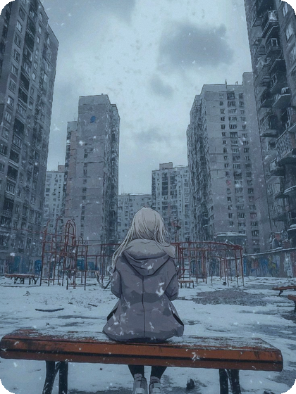

<div align="center">


[](https://git.io/typing-svg)


</div>

<br>



```text
$ whoami
> backend-разработчик, пишет код, когда город спит

$ cat /etc/motd
> дождь по крышам, сервер в проде, гитара в наушниках.
> фронт трогаю редко и только по мелочи.

$ ps aux | grep me
> c++  python  go  |  linux  git  docker  bash
```

<br clear="right">

<br>


<div align="center">

`то, что крутится в наушниках, пока собирается продакшн`

<br>

[](https://music.yandex.ru/artist/11087)
[](https://music.yandex.ru/artist/10280353)
[](https://music.yandex.ru/artist/4741972)

<br>

[](https://music.yandex.ru/artist/21264536)
[](https://music.yandex.ru/artist/15735215)
[](https://music.yandex.ru/artist/13002)
[](https://music.yandex.ru/artist/6314173)
[](https://music.yandex.ru/search?text=Gospod)
[](https://music.yandex.ru/search?text=Black%20Sabbath)
[](https://music.yandex.ru/search?text=Ka%24tro)
[](https://music.yandex.ru/artist/20001064)
[](https://music.yandex.ru/artist/556109)
[](https://music.yandex.ru/artist/42528)

</div>

<br>


<div align="center">

| Проект | Что это | Стек |
|---|---|---|
| 🌧️ **`night-rain-cli`** | Терминальная анимация дождя — для вайба во время кодинга | `C++` |
| ⚙️ **`panelka-api`** | REST/gRPC-сервис: данные по панелькам, метрики, трейсинг | `Go` `PostgreSQL` |
| 🐍 **`mixtape-daemon`** | Демон, который крутит плейлисты и следит за аптаймом | `Python` `systemd` |
| 📦 **`deploy-for-the-dead`** | Набор bash-скриптов деплоя: бэкапы, роллбэк, алёрты | `Bash` `Docker` |
| 🔧 **`cpp-toys`** | Песочница на C++: многопоточка, сети, свои контейнеры | `C++20` `CMake` |

[](https://github.com/worltroll/night-rain-cli)
[](https://github.com/worltroll/panelka-api)

</div>

<br>


<div align="center">

**основное — backend**

[](https://isocpp.org/)
[](https://www.python.org/)
[](https://go.dev/)

**иногда — фронт по мелочи**

[](https://developer.mozilla.org/ru/docs/Web/JavaScript)
[](https://www.typescriptlang.org/)
[](https://react.dev/)

**инструменты**

[](https://www.kernel.org/)
[](https://git-scm.com/)
[](https://www.docker.com/)
[](https://www.gnu.org/software/bash/)


</div>

<br>


<div align="center">

`если не отвечаю — значит, идёт дождь или деплой`

<br>

[](https://t.me/worltroll)
[](mailto:pakhomov.vs@yandex.ru)
[](mailto:pakhomov.vse@gmail.com)

<br>


</div>

<br>


