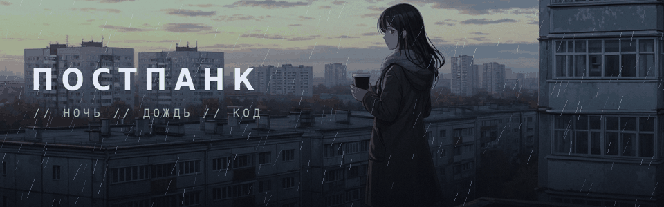
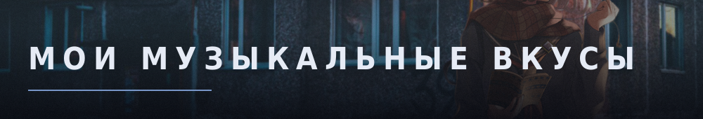
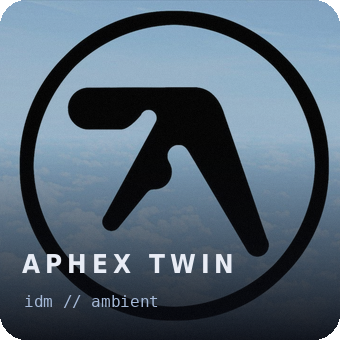
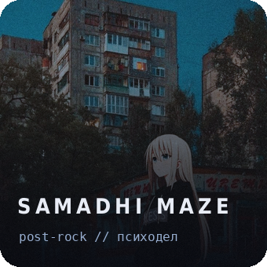
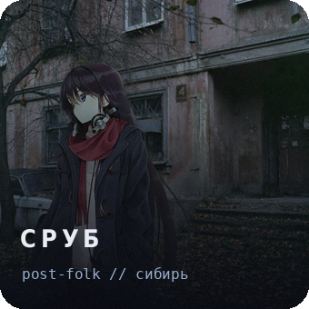
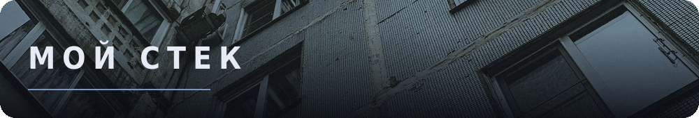

<div align="center">



[](https://git.io/typing-svg)


</div>

<br>

<div align="center">

```text
$ bio
> backend-разработчик из Москвы
> 15 y. o.

$ stack
> c++  python  go  |  linux  git  docker  bash
```

</div>

<br>



<div align="center">

`то, что крутится в наушниках, пока собирается продакшн`

<br>

[](https://music.yandex.ru/artist/11087)
[](https://music.yandex.ru/artist/10280353)
[](https://music.yandex.ru/artist/4741972)

<br>

[](https://music.yandex.ru/artist/21264536)
[](https://music.yandex.ru/artist/15735215)
[](https://music.yandex.ru/artist/13002)
[](https://music.yandex.ru/artist/6314173)
[](https://music.yandex.ru/search?text=Gospod)
[](https://music.yandex.ru/search?text=Black%20Sabbath)
[](https://music.yandex.ru/search?text=Ka%24tro)
[](https://music.yandex.ru/artist/20001064)
[](https://music.yandex.ru/artist/556109)
[](https://music.yandex.ru/artist/42528)

</div>

<br>


<div align="center">

| Проект | Что это | Стек |
|---|---|---|
| **`Ypsilon`** | Музыкальный плеер | `C++` |

[](https://github.com/worltroll/ypsilon)

</div>

<br>



<div align="center">

**основное — backend**

[](https://isocpp.org/)
[](https://www.python.org/)
[](https://go.dev/)

**иногда — фронт по мелочи**

[](https://developer.mozilla.org/ru/docs/Web/JavaScript)
[](https://www.typescriptlang.org/)
[](https://react.dev/)

**инструменты**

[](https://www.kernel.org/)
[](https://git-scm.com/)
[](https://www.docker.com/)
[](https://www.gnu.org/software/bash/)
[](https://en.wikipedia.org/wiki/SQL)


</div>

<br>


<div align="center">


<br>

[](https://t.me/worltroll)
[](mailto:pakhomov.vs@yandex.ru)
[](mailto:pakhomov.vse@gmail.com)

<br>


</div>

<br>


